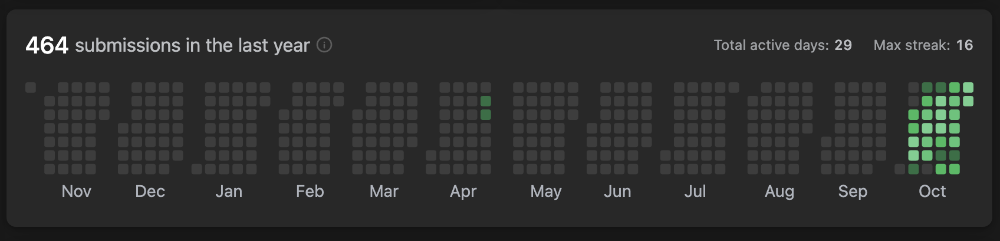

# LEETCODE GRIND 75

URL : [https://www.techinterviewhandbook.org/grind75](https://www.techinterviewhandbook.org/grind75)

Profile : [https://leetcode.com/bahgahbah/](https://leetcode.com/bahgahbah/)

## Attempts

1. 4th October - 31st October 2022

## Comments

- Getting the hang of utilizing 2 or more pointers, recursion, traversing linked list, 2d matrix, binary search, binary search tree, trie, graphs.
- Have basic understanding of min/max heaps, LRU, adjacency list/matrix but do not have the intuition on when to use it.
- Too reliant on using recursion/DFS, not familiar with using queue and stack based approach.
- Need to further develop intuition to solve problems thorugh
  - Understanding the question
  - Looking for patterns in the data
  - **_ Write pseudocode PRIOR to coding it up _**

## Learning materials

- [https://frontendmasters.com/courses/algorithms/](https://frontendmasters.com/courses/algorithms/)
- ### Main takeaways

  - Covers most of the common data structures and algorithms used, and also discusses Big O notation in a simplified manner.
  - If the algo is not dependent on input, it is a constant time operation.
  - O(1) < O(log N) < O(N) < O(N^2) etc...
  - Using the right data structure will improve running time i.e. but tradeoffs with space

    - Hashmap

      - Adding a [k, v] pair allows for O(1) lookup

    - Linked List (Singly or Doubly)

      - Similar to a List/Array (not in the JS sense where Array length are dynamic) with the advantage of being able to add additional elements.
        - Requires some manual book keeping by specifying
          - head, tail, length
          - breaking and making new links to prev/next nodes

    - Binary Tree

      - Traversal is O(log N) or O(h) where h = height of tree, improvement over O(N) for a regular array

    - Heaps

      - Instead of using a binary tree like structure, heaps can be implemented as an array, but using maths to identify parents/child
      - Useful data structure to retrieve min/max value where the collection of values are changing
      - New values added are arranged into their respective positions by **heapifying up**
      - Min/max values are taken out and the heap is then rearranged by taking the last child element, placing it at the root position and **heapifying down**

    - LRU (Least Recently Used)

      - Instead of storing values in a doubly linked list, where traversal is O(N)
        - Incorporate a lookup Hashmap with an array, lookup to any value is O(1)
        - Add a reverseLookup that takes in [v, k] pair for lookup book keeping when LRU reaches capacity

    - Trie (pronounced try, origin as Re**trie**val)

      - Think **autocomplete** or word prediction, retrieval is O(1) as it doesn't change respective to the number of input/size of trie. If it was implemented as an array, lookup would be O(N) as it'd be necessary to traverse the entire list.

    - Graphs
      - Everything is a graph
      - Based on the findings of Euler (pronounced oiler) bridge problem
      - Dikstra's Shortest Path
        - has interesting properties (https://www.youtube.com/watch?v=pVfj6mxhdMw)[https://www.youtube.com/watch?v=pVfj6mxhdMw]
